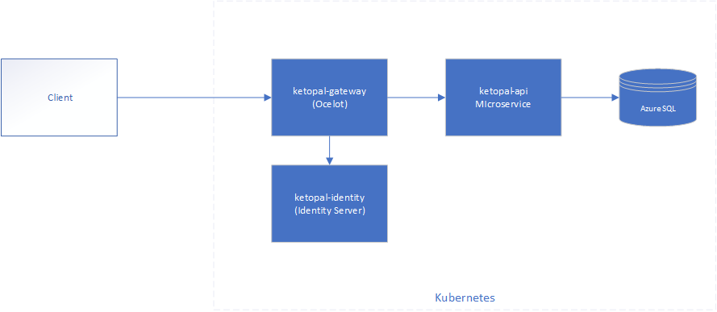
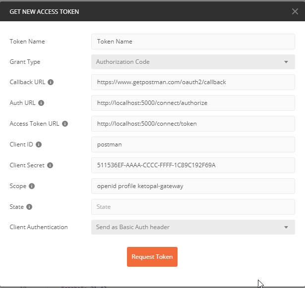

| Identity  | API  | Gateway  | Key Store |
|:-:|:-:|:-:| :-:|
| [](https://dev.azure.com/NebbiaDemo/KetoPalOnContainers/_build/latest?definitionId=182&branchName=master) |  [](https://dev.azure.com/NebbiaDemo/KetoPalOnContainers/_build/latest?definitionId=180&branchName=master) | [](https://dev.azure.com/NebbiaDemo/KetoPalOnContainers/_build/latest?definitionId=185&branchName=master) | [](https://dev.azure.com/NebbiaDemo/KetoPalOnContainers/_build/latest?definitionId=186&branchName=master) |

# KetoPalOnContainers
A sample microservices styles architecture hosted on Kubernetes with Identity Server and an API Gateway




## Getting Started

Right click on the `KetoPal.Identity` project and set the following local secrets

``` json
{
  "SMSAccountPassword": "",
  "SMSAccountIdentification": "",
  "SendGridUser": "",
  "SendGridKey": "",
  "SMSAccountFrom": "+14074444444"
}
```

Setting up Postman




